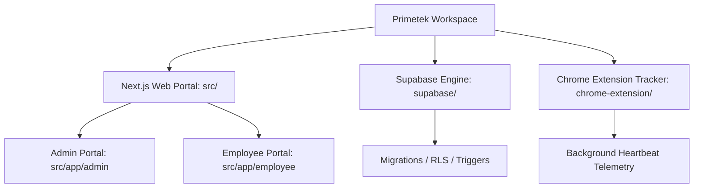

# Primetek Global Solutions — Visual & Design System Specification

This document defines the complete visual layout, component syntax, typography hierarchy, spacing rules, and Progressive Web App (PWA) guidelines for the **Primetek Global Solutions HR Portal**. It serves as the single source of truth for design engineering across the Admin and Employee interfaces.

---

## 1. Monorepo Architecture & Boundaries

The project is structured as a unified monorepo divided into three systems to enforce security boundaries and separate concerns:



*   **Next.js Web Portal (`src/`)**: 
    *   Powered by Next.js 16 (App Router), React 19, TailwindCSS v4, and Radix primitives.
    *   Segmented into `admin/` and `employee/` directories to prevent route leakage and visual pollution.
*   **Supabase Database Engine (`supabase/`)**:
    *   Stores relational data schemas, triggers for event-sourcing, and Row Level Security (RLS) policies.
*   **Chrome Extension Tracker (`chrome-extension/`)**:
    *   Runs locally on employee devices to synchronize authentication tokens and sync heartbeat status events.

---

## 2. Global Design Tokens & Configurations

### A. Color Palette (`src/app/globals.css` `@theme`)

The application implements a premium **Cal.com-inspired** color system. All tokens are configured in TailwindCSS v4 using `@theme inline`:

| Category | Token Variable | Hex Value | Primary Application |
| :--- | :--- | :--- | :--- |
| **Primary Brand** | `--color-primary-50` | `#f0fdfa` | Translucent alert/badge backgrounds |
| | `--color-primary-100` | `#ccfbf1` | Light background panels |
| | `--color-primary-200` | `#99f6e4` | Selection highlight fill |
| | `--color-primary-500` / `--color-primary` | `#0f766e` | Brand default Teal (CTAs, primary focus) |
| | `--color-primary-600` / `--color-primary-active` | `#0b8b83` | Active state hover / click actions |
| | `--color-primary-900` | `#0f172a` | Headers / dark layout container wrappers |
| **Teal Highlights**| `--color-teal-accent` / `--color-accent` | `#14b8a6` | Attention beacons, subtle toggle underlines |
| **Navy Scale** | `--color-navy-50` | `#f8fafc` | Default app body backgrounds |
| | `--color-navy-800` | `#1e293b` | Secondary text block backdrops |
| | `--color-navy-900` / `--color-surface-dark` | `#0f172a` | Employee Portal navigation bar and dark cards |
| | `--color-navy-950` / `--color-navy-955` | `#020617` | Full-bleed Login background |
| **Gold / Alert** | `--color-gold-400` / `--color-gold-500` | `#fb923c` / `#f97316` | Gold/Orange text gradient stops and warning states |
| **Zinc Grays** | `--color-zinc-150` | `#f4f4f5` | Inline borders |
| | `--color-zinc-250` | `#e4e4e7` | Card outlines and section dividers |
| | `--color-zinc-550` | `#71717a` | Medium body text |
| | `--color-zinc-650` | `#52525b` | Standard label descriptions |
| **Semantic States**| `--color-success` | `#10b981` | Clocked In, Active, Approved status badges |
| | `--color-warning` | `#f59e0b` | Breaks, late check-ins, pending requests |
| | `--color-error` | `#ef4444` | Absent, GPS alerts, force logout events |

---

### B. Typography (`src/styles/design-system.ts`)

Typography uses a clear font-pairing structure to maintain a technical, clean SaaS feel:

*   **Font Families**:
    *   **Body & Interface Text (`font-sans`)**: Inter (`var(--font-inter)`)
    *   **Headings & Title Elements (`font-heading`)**: Lexend (`var(--font-lexend)`)
    *   **Technical Identifiers & Metrics (`font-mono`)**: Monospace (`var(--font-mono)`)
*   **Typography Hierarchy**:

```typescript
export const typography = {
  // Headings
  pageTitle: "text-xl md:text-2xl font-bold tracking-tight text-navy-900",
  pageTitleLight: "text-2xl md:text-3xl font-extrabold tracking-tight text-white",
  sectionTitle: "text-lg font-semibold text-navy-900",
  cardTitle: "text-base font-semibold text-navy-900",
  
  // Body Text
  body: "text-sm text-zinc-650 leading-relaxed",
  bodyMuted: "text-xs text-zinc-500 leading-relaxed",
  label: "text-xs font-semibold text-navy-900",
  
  // Tables & Metadata
  tableHeader: "text-[11px] font-mono font-semibold uppercase tracking-wider text-zinc-500",
  tableCell: "text-sm text-navy-900 font-medium",
  badge: "text-[11px] font-semibold tracking-wider uppercase",
};
```

> [!IMPORTANT]
> **Readability Safeguard**: To prevent visual fatigue and support WCAG AA readability, any inline raw styling using `text-[8px]`, `text-[9px]`, or `text-[10px]` is intercepted in the global stylesheet (`globals.css`) and forced to a minimum threshold of `11px` via:
> ```css
> .text-\[8px\], .text-\[9px\], .text-\[10px\] {
>   font-size: 11px !important;
> }
> ```

---

### C. Layout Grid, Spacing & Border Radius

```typescript
export const spacing = {
  sectionGap: "space-y-6",
  gridGap: "gap-4",
  gridGapLarge: "gap-6",
  cardPadding: "p-4 md:p-5",
  formGap: "space-y-4",
  formGridGap: "gap-4",
};

export const radius = {
  card: "rounded-xl",      // 12px - Used for dashboard widgets
  button: "rounded-lg",    // 8px - Standard buttons
  input: "rounded-lg",     // 8px - Form input fields
  badge: "rounded-full",   // 9999px - Status indicators
  avatar: "rounded-lg",    // 8px - User profile frames
};

export const shadow = {
  sm: "shadow-sm",
  md: "shadow-md border border-border/80",
  premium: "shadow-sm border border-border/60 hover:shadow-md hover:border-primary-300/30 transition-all duration-200",
};

export const layout = {
  adminMaxWidth: "max-w-7xl mx-auto w-full px-4 sm:px-6 lg:px-8",
  employeeMaxWidth: "max-w-7xl mx-auto w-full px-4 sm:px-6 lg:px-8",
  sidebarWidth: "w-64",
  sidebarCollapsedWidth: "w-16",
};
```

---

## 3. PWA App Shell & Adaptive Navigation

The PWA interface features adaptive components that shift dynamically based on device viewports:

```
┌─────────────────────────────────────────────────────────┐
│  Desktop View: [AppSidebar] (Left) + Content (Right)    │
│  ┌───┐ ┌──────────────────────────────────────────────┐ │
│  │   │ │ Header (AppHeader.tsx)                       │ │
│  │   │ ├──────────────────────────────────────────────┤ │
│  │   │ │                                              │ │
│  │   │ │ Page Content (Max-width 1280px)              │ │
│  │   │ │                                              │ │
│  └───┘ └──────────────────────────────────────────────┘ │
└─────────────────────────────────────────────────────────┘
┌──────────────────────────────────────────────┐
│  Mobile PWA View: Single Column Shell        │
│  ┌────────────────────────────────────────┐  │
│  │ Header (AppHeader.tsx)                 │  │
│  ├────────────────────────────────────────┤  │
│  │                                        │  │
│  │ Page Content                           │  │
│  │                                        │  │
│  ├────────────────────────────────────────┤  │
│  │ Mobile Bottom Bar Navigation (h-16)    │  │
│  └────────────────────────────────────────┘  │
└──────────────────────────────────────────────┘
```

*   **Desktop Layout**:
    *   Renders `AppSidebar` pinned to the left (`w-64`). Features sidebar section groups (`Operations`, `Workforce`, `Recruitment & Clients`, `Security & Compliance`, `System Management`).
    *   Main content viewport: Centered `max-w-7xl` frame.
*   **Mobile PWA Layout**:
    *   Sidebar is hidden. Navigation transitions to a fixed sticky bottom menu bar: `fixed bottom-0 left-0 right-0 h-16 bg-white border-t border-zinc-200 z-30`.
    *   Displays 4 high-frequency action items (`LayoutDashboard`, `Clock`, `CheckSquare` / `ClipboardList`, `Users` / `FileUser`) and a `MoreHorizontal` button to toggle a sliding settings overlay sheet.
*   **Safe Areas**: Implements mobile padding adjustments to prevent navigation overlap using environment-safe values:
    *   `pb-[calc(4.5rem+env(safe-area-inset-bottom))]` is used for content layout main wrappers.

---

## 4. Specific Dashboard Visual Architectures

### A. Admin Dashboard System (`src/app/admin/dashboard/`)

*   **Grid Framework**: 9-column horizontal widget grid (`grid-cols-3 md:grid-cols-5 lg:grid-cols-9 gap-3`).
*   **SaaS KPI Cards**: 
    *   White canvas background (`bg-white`), `rounded-xl` card styling, and custom subtle hairline border (`border-zinc-250/70`).
    *   Visual indicators: Colored Lucide icons with transparent background tints (e.g., `bg-emerald-500/10 text-emerald-600`) and green pulsing indicator dots for real-time streaming updates.
*   **Audit Activity Timeline**:
    *   Left vertical timeline line (`border-l-2 border-zinc-100 ml-4`).
    *   Interactive items feature absolute time stamps (`Just now`, `5m ago`), relative labels, and distinct action badge icons (e.g., green `LogIn` for clock-in, red `LogOut` for clock-out, orange `MapPin` for GPS warnings).
*   **Operational Health Checker**:
    *   Renders list widgets for system services (API, DB, Auth, Mail). Uptime status includes blinking green pulsing status lights.

---

### B. Employee Dashboard System (`src/app/employee/dashboard/`)

*   **Device Shell Emulation**: The employee portal is framed inside a strict wrapper (`max-w-[430px] border-x border-[#E8EDF2] mx-auto bg-[#F7F8FA]`) on wide viewports to force a standardized mobile screen appearance on desktop.
*   **Sleek Gradient Hero Block**:
    *   Spans `min-h-[255px]` with a `rounded-[24px]` radius, using a navy-to-teal gradient background (`bg-gradient-to-r from-navy-900 to-primary-600`).
    *   Translucent Employee ID badge (`bg-white/10 text-primary-400 text-[10px] rounded-full px-3 py-1 font-mono uppercase tracking-wider`).
    *   Displays a floating, transparent 3D clock graphic (`/clock_image_transparent.png`) positioned absolute on the right.
    *   **Double Action Bar**: Contains two symmetrical buttons: "Clock In / Out" and "Request Leave". Styled as frosted overlays: `bg-white/15 backdrop-blur-md rounded-[20px] p-3 border border-white/20 hover:bg-white/20 active:scale-[0.98] transition-all`.
*   **Today's Progress Block**:
    *   Renders attendance shifts with a live JavaScript counter (`liveHours`) that calculates elapsed hours and minutes in real-time.

---

## 5. UI/UX Audit Findings & Remediation Roadmap

To ensure visual consistency and compliance with WCAG accessibility standards, the following guidelines are enforced:

### 1. Color Contrast & Legibility (WCAG 2.1 AA)
*   **Contrast floor**: All label colors on white surfaces must exceed **4.5:1** contrast. Replacing `text-zinc-400` with `text-zinc-550` or standardizing small labels ensures correct reading contrast.
*   **Non-Standard Tokens**: Refactor arbitrary styling classes like `text-amber-605` or `bg-primary-55` to standard Tailwind configurations.

### 2. Layout Modularity
*   **Status Indicators**: Consolidate redundant status badge markup (previously duplicated across `admin/attendance`, `employee/attendance`, and `employee/reports`) into a single reusable component located in `components/ui/StatusBadge.tsx`.

### 3. Modal Dialog Guidelines
*   **Focus Trap**: Any dialog modal (Leaves, profile overlays) must trap the focus of the tab key inside the modal box.
*   **Escape to Dismiss**: Intercept keyboard shortcuts to dismiss dialog windows when the user presses `Escape` (`onKeyDown`).
*   **Touch Targets**: Interactive controls must maintain a minimum target size of `44x44px` on mobile layouts.

---

## 6. Prompt Master Output (Reusable System Prompt)

Below is the optimized copyable prompt used to audit, design, or implement this visual design style in future portal interfaces.

```markdown
# System Prompt: Primetek SaaS Design System Auditor

You are a Senior UI/UX Engineer and Frontend Auditor specializing in high-density developer platforms (inspired by Vercel, Linear, Stripe, and Cal.com). 

Your task is to analyze, scaffold, or refactor pages in this codebase to ensure they align perfectly with the design system specifications.

<context>
The workspace runs on Next.js 16 (App Router), React 19, and TailwindCSS v4. It features a Cal.com-inspired Teal-Green (`#0f766e`) and Navy (`#0f172a`) theme, dividing layouts into full-width Admin Panels and a mobile-first PWA Employee Portal (max-width 430px centered shell).
</context>

<design_rules>
Ensure all files strictly enforce:
1. **Color Tokens**: Only use the standardized `@theme` tokens. Primary brand Teal is `bg-primary` / `bg-primary-500` (#0f766e). Neutral dark Navy is `bg-navy-900` (#0f172a). 
2. **Typography Pairing**: Headings must use Lexend (`font-heading`); body must use Inter (`font-sans`); metadata, statuses, and codes must use monospaced fonts (`font-mono`).
3. **Card Spacing & Radius**: 
   - Standard dashboard components use `rounded-xl` with custom hairline borders (`border-zinc-250/70`).
   - Hero banners use `rounded-[24px]` with rich gradient sweeps (`bg-gradient-to-r from-navy-900 to-primary-600`).
   - Standard buttons and inputs use `rounded-lg`.
4. **Mobile Layout Rules**: Safe-area offsets (`pb-[calc(4.5rem+env(safe-area-inset-bottom))]`) must be utilized on all container wrappers to prevent overlap with the mobile bottom PWA tab navigation bar.
5. **Accessibility Rules**:
   - Icon-only interactive elements must have clear descriptive `aria-label` tags.
   - Modal views must trap keyboard focus and support dismissal via the Escape key.
   - Text colors must meet a minimum contrast ratio of 4.5:1. Small captions should never fall below 11px font sizes.
</design_rules>

<output_format>
Analyze the requested page/component and supply:
1. An evaluation of any design token deviations or alignment defects.
2. A complete refactored code block representing the visual improvement.
3. A checklist detailing how accessibility targets and layout constraints are met.
</output_format>
```

*   **Target**: Claude 3.5 Sonnet / Gemini Pro
*   **Optimization**: Contains explicit markup rules, layout classes, and boundary definitions to enforce high-density SaaS design constraints and accessibility rules.
